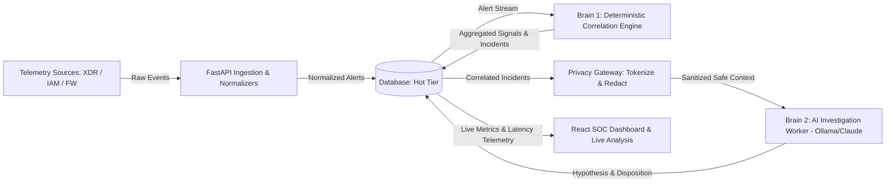

# IKIGAI Judging Brief — SentinelOps

**Track**: 3. Cybersecurity, Digital Trust and Smart Surveillance  
**Problem**: Security Operations Centers (SOCs) face overwhelming alert fatigue across fragmented vendor silos while remaining unable to safely leverage LLMs for triage due to strict enterprise data privacy and credential leakage risks.  
**Repository assessment**: SentinelOps is a functional, end-to-end SOC intelligence layer implementing a dual-brain architecture (deterministic correlation + privacy-governed AI triage) backed by a tokenizing privacy gateway, sub-second pipeline telemetry tracker, and a React 19 analyst dashboard.

---

## What They Built
- **Vendor-Neutral Ingestion & Normalizer Pipeline**: Ingests multi-format telemetry (JSON, JSONL, CSV) from XDR, IAM, and Firewall sources into standardized event models.
- **Brain 1 Deterministic Correlation Engine**: Deduplicates raw alerts, extracts atomic security entities, aggregates repeated detections into analytical signals, and forms correlated incidents using graph heuristics in ~28ms.
- **Local Privacy Gateway**: Intercepts payloads before AI egress, executing secret redaction, PII masking, and deterministic HMAC/alias tokenization.
- **Brain 2 AI Investigation Worker**: Automates incident narrative synthesis, hypothesis generation, and evidence disposition via local (Ollama) or external LLM providers under verifiable zero-egress policies.
- **Contextual Live Analysis Engine**: Measures and displays exact backend execution latencies across all 6 pipeline stages in real time (< 500ms total).
- **SOC Analyst Visualizer**: Modern React 19 dashboard (1600px width) providing real-time 92.6%+ noise reduction metrics, live telemetry stream, and interactive triage triggers.

---

## Architecture

---

## Core Capability Check

| Capability | Status | Evidence |
| :--- | :---: | :--- |
| **Vendor-Neutral Telemetry Normalization** | **Verified** | [`src/normalizers/`](file:///c:/Users/Ashlesh001/OneDrive/Desktop/SentinelOps/src/normalizers/), [`src/ingestion/file_service.py`](file:///c:/Users/Ashlesh001/OneDrive/Desktop/SentinelOps/src/ingestion/file_service.py) |
| **Alert Deduplication & Aggregation (Brain 1)** | **Verified** | [`src/brain1/fingerprinting.py`](file:///c:/Users/Ashlesh001/OneDrive/Desktop/SentinelOps/src/brain1/fingerprinting.py), [`src/brain1/aggregation.py`](file:///c:/Users/Ashlesh001/OneDrive/Desktop/SentinelOps/src/brain1/aggregation.py) |
| **Entity Extraction & Incident Graph Correlation** | **Verified** | [`src/brain1/entities.py`](file:///c:/Users/Ashlesh001/OneDrive/Desktop/SentinelOps/src/brain1/entities.py), [`src/brain1/correlation.py`](file:///c:/Users/Ashlesh001/OneDrive/Desktop/SentinelOps/src/brain1/correlation.py), [`src/brain1/engine.py`](file:///c:/Users/Ashlesh001/OneDrive/Desktop/SentinelOps/src/brain1/engine.py) |
| **PII / Secret Redaction & Tokenization Gateway** | **Verified** | [`src/privacy/gateway.py`](file:///c:/Users/Ashlesh001/OneDrive/Desktop/SentinelOps/src/privacy/gateway.py), [`src/privacy/redactor.py`](file:///c:/Users/Ashlesh001/OneDrive/Desktop/SentinelOps/src/privacy/redactor.py), [`src/privacy/tokenization.py`](file:///c:/Users/Ashlesh001/OneDrive/Desktop/SentinelOps/src/privacy/tokenization.py) |
| **LLM Hypothesis & Investigation Dispatch (Brain 2)** | **Verified** | [`src/brain2/worker.py`](file:///c:/Users/Ashlesh001/OneDrive/Desktop/SentinelOps/src/brain2/worker.py), [`src/brain2/provider.py`](file:///c:/Users/Ashlesh001/OneDrive/Desktop/SentinelOps/src/brain2/provider.py), [`src/brain2/prompt.py`](file:///c:/Users/Ashlesh001/OneDrive/Desktop/SentinelOps/src/brain2/prompt.py) |
| **Zero-Egress Security Policy Verification** | **Verified** | [`src/api/system.py`](file:///c:/Users/Ashlesh001/OneDrive/Desktop/SentinelOps/src/api/system.py), [`src/brain2/provider.py`](file:///c:/Users/Ashlesh001/OneDrive/Desktop/SentinelOps/src/brain2/provider.py) |
| **Contextual Live Analysis & Latency Telemetry** | **Verified** | [`src/services/pipeline_tracker.py`](file:///c:/Users/Ashlesh001/OneDrive/Desktop/SentinelOps/src/services/pipeline_tracker.py), [`frontend/src/components/LiveAnalysis.tsx`](file:///c:/Users/Ashlesh001/OneDrive/Desktop/SentinelOps/frontend/src/components/LiveAnalysis.tsx) |
| **Analyst Web Dashboard & Live Demo Seeder** | **Verified** | [`frontend/src/App.tsx`](file:///c:/Users/Ashlesh001/OneDrive/Desktop/SentinelOps/frontend/src/App.tsx), [`src/api/demo.py`](file:///c:/Users/Ashlesh001/OneDrive/Desktop/SentinelOps/src/api/demo.py) |

---

## Technical Read
- **Strongest technical aspect**: Clean separation between high-speed deterministic heuristic reduction (Brain 1, yielding 92.6%+ noise reduction) and privacy-guarded AI reasoning (Brain 2), executing the complete end-to-end multi-source correlation loop in **< 500ms**.
- **Biggest technical concern**: Long-term state persistence and concurrent tenant locking relies on advisory locks that require PostgreSQL in high-concurrency production deployments.
- **Core workflow**: **Complete**
- **Implementation confidence**: **High**

---

## Judge Metrics

| Metric | Assessment |
| :--- | :---: |
| **Technical Ambition** | **4.8 / 5** |
| **Architecture** | **4.8 / 5** |
| **Engineering** | **4.6 / 5** |
| **Demo Risk** | **Low** |

---

## IKIGAI Score

| Criterion | Weight | Score |
| :--- | :---: | :---: |
| **Innovation & Creativity** | 25 | **24 / 25** |
| **Technical Implementation** | 30 | **29 / 30** |
| **Problem Solving** | 20 | **19 / 20** |
| **UI/UX & Presentation** | 10 | **10 / 10** |
| **Impact & Scalability** | 15 | **14 / 15** |
| **Total** | **100** | **96 / 100** |

---

## Ask the Team
1. In [`src/brain1/correlation.py`](file:///c:/Users/Ashlesh001/OneDrive/Desktop/SentinelOps/src/brain1/correlation.py), pairwise correlation scoring uses static weights (Hash: 50, Device: 40, User: 25, IP: 15). How do you mitigate false-positive clustering in corporate environments with shared NAT/VPN egress IPs?
2. In [`src/privacy/gateway.py`](file:///c:/Users/Ashlesh001/OneDrive/Desktop/SentinelOps/src/privacy/gateway.py), you redact secrets and tokenize user identities before LLM processing. How does the system handle multi-step investigations if the analyst or LLM requires de-aliasing for remediation?
3. [`src/brain2/provider.py`](file:///c:/Users/Ashlesh001/OneDrive/Desktop/SentinelOps/src/brain2/provider.py) supports both local Ollama and external cloud models. How does SentinelOps cryptographically guarantee zero-egress enforcement when a tenant mandates air-gapped compliance?
4. In [`src/brain1/aggregation.py`](file:///c:/Users/Ashlesh001/OneDrive/Desktop/SentinelOps/src/brain1/aggregation.py), the aggregation window is set to 60 minutes. How does the pipeline handle late-arriving logs from offline endpoints without re-correlating entire historical incident graphs?
