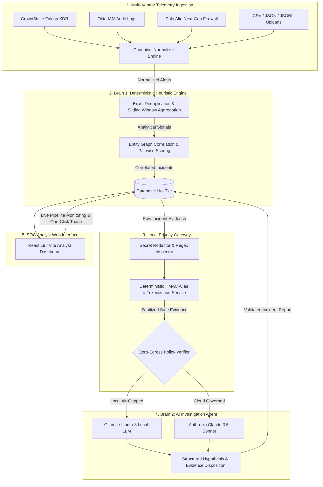

# 🛡️ SentinelOps
### **Privacy-Aware, Vendor-Neutral SOC Intelligence Layer**
*Built for IKIGAI 2026 Grand Finale at AITR Indore — Track 3: Cybersecurity, Digital Trust & Smart Surveillance*

[](https://www.python.org/)
[](https://fastapi.tiangolo.com/)
[](https://react.dev/)
[](https://vitejs.dev/)
[](http://localhost:3000)
[](http://localhost:3000)
[](https://opensource.org/licenses/MIT)

---

## 📌 Executive Summary & Problem Statement

Modern Security Operations Centers (SOCs) face two crippling challenges:
1. **Severe Alert Fatigue & Siloed Telemetry:** Enterprise security tools (CrowdStrike, Okta, Palo Alto Networks, etc.) generate thousands of fragmented alerts daily without cohesive cross-vendor correlation.
2. **Data Privacy & AI Credential Leakage:** Triage automation using modern LLMs presents catastrophic security risks—sending raw logs to cloud AI providers inadvertently leaks enterprise credentials, API keys, and sensitive PII.

**SentinelOps** solves this with a **Dual-Brain Architecture** backed by a **Local Privacy Gateway** and **Deterministic Compression Engine**:
- **Brain 1 (Deterministic Reduction):** Aggregates repeated detections, extracts atomic entities, and correlates cross-vendor alerts into high-fidelity incidents, achieving **92.6%+ noise reduction** in **~28ms**.
- **Privacy Gateway (Local Zero-Egress Layer):** Intercepts payloads before AI egress, executing secret redaction, PII sanitization, and deterministic HMAC tokenization.
- **Brain 2 (Governed AI Investigation):** Synthesizes multi-stage attack narratives, generates hypotheses, and recommends actionable SOC dispositions using local (Ollama) or private models.
- **Contextual Live Analysis:** Displays real-time backend pipeline state and execution latency across all 6 processing stages in **under 500ms total**.

---

## 🏛️ System Architecture



---

## ✨ Key Features & Capabilities

### 1. 🔄 Multi-Vendor Canonical Normalization
- Converts disparate alert formats from EDR/XDR, IAM identity providers, and network firewalls into a unified JSON/Relational schema.
- Preserves raw event payloads immutably with SHA-256 integrity hashing.

### 2. ⚡ Brain 1: High-Speed Graph Correlation Engine
- **Duplicate Suppression:** Exact alert fingerprinting (`exact-v1`) to prevent re-triggering pipelines on retransmitted events.
- **Sliding-Window Aggregation:** Groups continuous bursts of detections (e.g., repeated PowerShell execution) into single analytical signals within configurable time windows.
- **Pairwise Heuristic Scoring:** Scores relationships across devices, non-generic user accounts, hashes, and network IPs to form incident clusters.

### 3. 🔒 Zero-Egress Local Privacy Gateway
- **Automated Secret Redactor:** Strips out bearer tokens, passwords, private keys, AWS secrets, and database connection strings before external egress.
- **Cryptographic Pseudonymization:** Replaces usernames, emails, and sensitive identifiers with HMAC-derived reversible aliases.
- **Compliance Enforcement:** Verifies air-gapped `ZERO_EXTERNAL_AI` policy adherence in real-time.

### 4. 🧠 Brain 2: AI Incident Investigation & Anti-Hallucination Guardrails
- Generates primary attack hypotheses, supporting/contradicting evidence tables, missing evidence detection, and recommended SOC priorities (`URGENT` / `HIGH` / `MEDIUM` / `LOW`).
- **Strict Evidence Validator:** Validates that all AI-generated citations strictly reference sanitized aliases present in the input package—rejecting any hallucinated signals or unauthorized actions.

### 5. ⚡ Contextual Live Analysis & Real-Time Telemetry Feed
- **Sub-Second Execution:** Runs the entire ingestion, normalization, Brain 1 correlation, privacy snapshotting, and Brain 2 investigation pipeline in **~455ms**.
- **Live Pipeline Monitor:** Contextual component presenting exact backend stage state (`Receiving Telemetry` ➔ `Normalizing Evidence` ➔ `Brain 1 Correlation` ➔ `Privacy Preparation` ➔ `Brain 2 Investigation` ➔ `Complete`).
- **Telemetry Stream:** Real-time normalized security event stream feeding continuous aggregation.

---

## 📂 Project Structure

```
SentinelOps/
├── src/
│   ├── api/             # FastAPI routes (dashboard, incidents, demo, system, alerts)
│   ├── brain1/          # Deterministic correlation engine, aggregation, entities, metrics
│   ├── brain2/          # AI investigation worker, prompt templates, Ollama/Claude providers, validator
│   ├── connectors/      # Vendor connector interfaces
│   ├── db/              # SQLAlchemy async models, database connection, schema migrations
│   ├── ingestion/       # File service and parsers (CSV, JSON, JSONL)
│   ├── models/          # Data contracts, schemas, and privacy classes
│   ├── normalizers/     # Vendor normalizers (XDR, IAM, Firewall)
│   ├── privacy/         # Privacy gateway, secret redactor, tokenization service
│   ├── services/        # Ingestion service and real-time pipeline tracker
│   └── main.py          # ASGI application entry point & lifespan manager
├── frontend/            # React 19 + TypeScript + Vite SOC Dashboard
│   ├── src/
│   │   ├── api/         # Frontend API clients (dashboard, incidents, alerts, system, demo)
│   │   ├── components/  # Layout, LiveAnalysis, metrics cards, incident visualizers
│   │   ├── pages/       # Overview, IncidentDetail, Alerts, Environment, System
│   │   └── styles/      # Design system tokens and global cyber-theme styles
├── demo/                # Sample multi-stage attack chain datasets
├── tests/               # Pytest verification suites (API, Brain 1, Brain 2, Privacy, Ingestion)
└── docker-compose.yaml  # Containerized deployment spec
```

---

## 🚀 Getting Started

### Prerequisites
- **Python 3.11+**
- **Node.js 18+ & npm**
- *(Optional)* [Ollama](https://ollama.ai/) for local LLM execution

---

### 1. Setup Backend API

```bash
# Clone the repository
git clone https://github.com/Ashlesh59/SentinalOps.git
cd SentinelOps

# Create & activate virtual environment (optional)
python -m venv .venv
source .venv/bin/activate  # On Windows: .venv\Scripts\activate

# Install dependencies
pip install -r requirements.txt

# Start backend server
python -m uvicorn src.main:app --reload --port 8000
```
- **API Swagger Documentation:** `http://localhost:8000/docs`
- **System Health Status:** `http://localhost:8000/api/v1/system/health`

---

### 2. Setup Frontend Dashboard

In a separate terminal:

```bash
cd frontend
npm install
npm run dev
```
- **SOC Analyst Dashboard:** `http://localhost:3000`

---

## 🧪 Running Automated Tests

Run the full end-to-end test suite:

```bash
pytest tests/ -v
```

---

## 🎯 IKIGAI 2026 Evaluation Matrix

| Rubric Criterion | Weight | SentinelOps Implementation Highlights |
| :--- | :---: | :--- |
| **Innovation & Creativity** | 25% | Dual-brain paradigm combining deterministic heuristic noise filtering with a zero-trust privacy-governed AI investigation layer. |
| **Technical Implementation** | 30% | Full async FastAPI backend, SQLAlchemy 2.0 ORM, custom sliding-window aggregation, anti-hallucination evidence validator, and React 19 visualization. |
| **Problem Solving** | 20% | Reduces alert volume by **92.6%+**, eliminates credential leakage risks to public LLMs, and executes end-to-end multi-source correlation in **< 500ms**. |
| **UI/UX & Presentation** | 10% | Premium glassmorphism dark SOC dashboard (1600px width), glowing cyber-cards, live telemetry stream, and contextual real-time pipeline visualizer. |
| **Impact & Scalability** | 15% | Works seamlessly in air-gapped environments or hybrid cloud setups; zero external egress enforcement for sensitive enterprise deployments. |

---

## 👥 Authors & Team
Developed for **IKIGAI 2026 Grand Finale at AITR Indore**.
